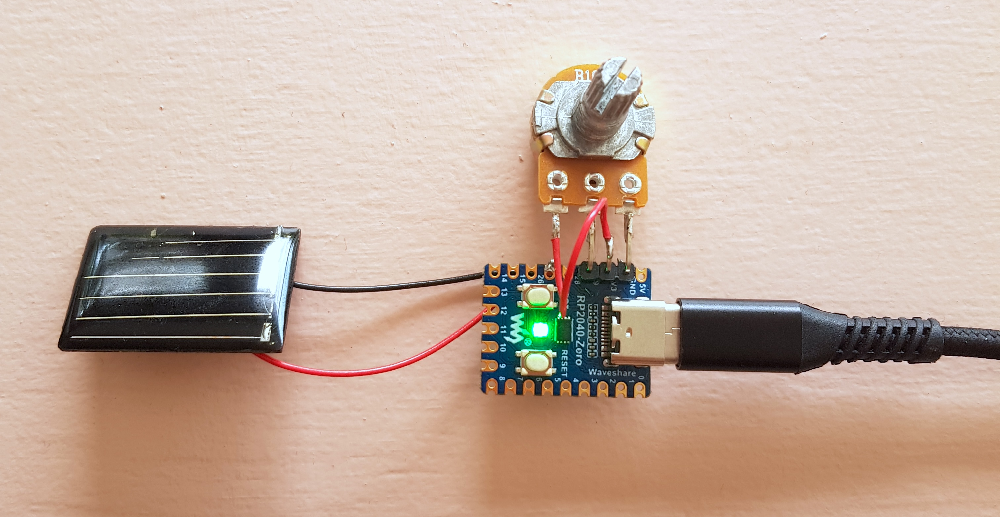

# photovoltaique_sensor
a punk light sensor with photovoltaic cell + rp2040 + circuitpython

| | MCU |
| :------------------- | :----------: |
| pot pin +                | 3v3 |
| pot pin data           | pin29 |
| pot pin -                | GND |
| cell +               | pin 27 |
| cell GND             | GND |

